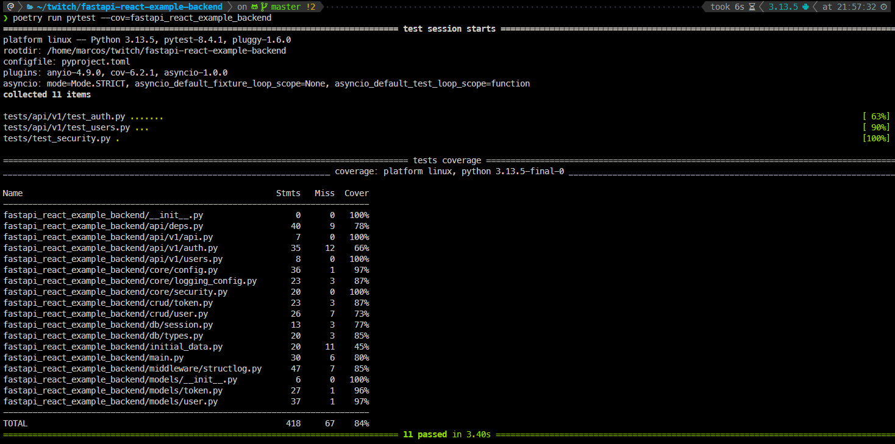

# FastAPI React Example - Backend
This is a FastAPI backend for a React application, providing user authentication and management features.

## Key Features
- User authentication with JWT tokens.
- Models and schemas with SQLModel.
- Completely async codebase and database operations, using asyncpg.
- Dependency injection for database sessions.
- Middleware for structured logging with Structlog.
- API versioning and well-structured endpoints.
- Tests for API endpoints using pytest, pytest-asyncio, and httpx. Using DB session dependency injection and fuxtures for testing with aiosqlite on memory database.
- Tests coverage reporting with pytest-cov.

## Installation
1. Clone the repository.
2. Install the environment with `poetry install`.
3. Set up the environment variables in a `.env` file or use the provided `.env.example` as a template.
4. Start the FastAPI development server:
    ```bash
    poetry run fastapi dev fastapi_react_example_backend/main.py
    ```

## Testing
Run the tests using:
```bash
poetry run pytest
```

Run the tests with coverage using:
```bash
poetry run pytest --cov=fastapi_react_example_backend
```



## Frontend Repository
For the frontend React application, visit the [FastAPI React Example Frontend](https://github.com/M4RC0Sx/FastAPI-React-Example-Frontend).